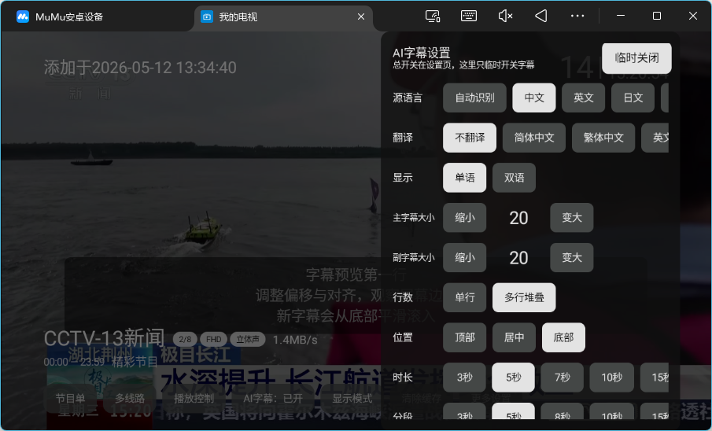
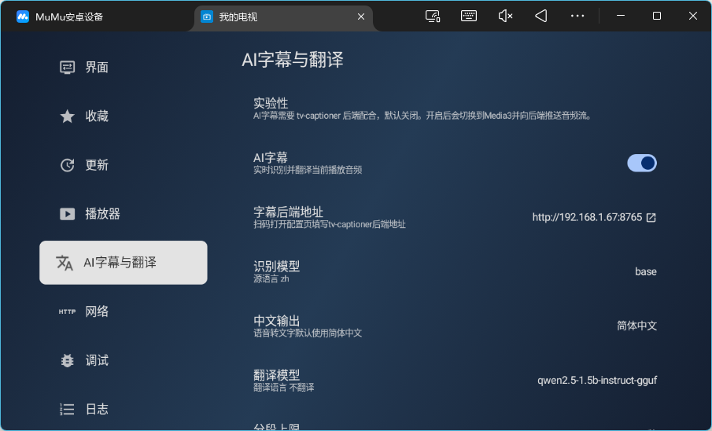

    <h1>我的电视</h1>

    
面向电视直播场景的 AI 字幕增强版，支持实时语音识别、翻译字幕与双语字幕显示。

## AI 字幕

本项目在“我的电视”基础上重点增强了 AI 实时字幕能力，适合新闻、外语频道、无字幕直播源等场景使用。开启后，播放器会采集直播音频并接入 `tv-captioner` 后端，实时生成字幕；也可以开启双语字幕，同时显示原文识别结果和翻译结果。

- 支持实时语音转文字字幕
- 支持翻译字幕与双语字幕显示
- 支持简体中文、繁体中文或原始输出格式
- 支持通过网页配置字幕后端、源语言、目标语言和模型
- 支持在播放时使用快捷设置开关字幕、双语模式、字号、位置和对齐方式
- AI 字幕依赖 Media3 播放器，开启后会自动切换到 Media3

### 开启方式

1. 在电视端进入：`设置` > `播放器` > `AI字幕`
2. 打开设置页最后一项显示的网页地址，通常为：`http://<设备IP>:10481`
3. 在网页的 `AI字幕` 区域填写 `tv-captioner` 后端地址，选择模型后点击 `推送字幕配置`

## 使用

### 操作方式

> 遥控器操作方式与主流电视直播软件类似；

- 频道切换：使用上下方向键，或者数字键切换频道；屏幕上下滑动；
- 频道选择：OK键；单击屏幕；
- 设置页面：按下菜单、帮助键，长按OK键；双击、长按屏幕；

### 触摸键位对应

- 方向键：屏幕上下左右滑动
- OK键：点击屏幕
- 长按OK键：长按屏幕
- 菜单、帮助键：双击屏幕

### 自定义设置

- 访问以下网址：`http://<设备IP>:10481`
- 打开应用设置界面，移到最后一项
- 支持自定义直播源、自定义节目单、缓存时间等等

### 自定义直播源

- 设置入口：自定义设置网址
- 格式支持：m3u格式、tvbox格式

### 多直播源

- 设置入口：打开应用设置界面，选中`自定义直播源`项，点击后将弹出历史直播源列表
- 历史直播源列表：短按可切换当前直播源（需重启），长按将清除历史记录；该功能类似于`多仓`，主要用于简化直播源切换流程
- 须知：
    1. 当直播源数据获取成功时，会将该直播源保存到历史直播源列表中
    2. 当直播源数据获取失败时，会将该直播源移出历史直播源列表

### 多线路

- 功能描述：同一频道拥有多个播放地址，相关标识位于频道名称后面
- 切换线路：左右方向键；屏幕左右滑动
- 自动切换：当当前线路播放失败后，将自动播放下一个线路，直至最后

### 自定义节目单

- 设置入口：自定义设置网址
- 格式支持：.xml、.xml.gz格式

### 多节目单

- 设置入口：打开应用设置界面，选中`自定义节目单`项，点击后将弹出历史节目单列表
- 具体功能请参照`多直播源`

### 当天节目单

- 功能入口：打开应用选台界面，选中某一频道，按下菜单、帮助键、双击屏幕，将打开当天节目单
- 须知：由于该应用不支持回放功能，所以更早的节目单没必要展示

### 频道收藏

- 功能入口：打开应用选台界面，选中某一频道，长按OK键、长按屏幕，将收藏/取消收藏该频道
- 切换显示收藏列表：首先移动到频道列表顶部，然后再次按下方向键上，将切换显示收藏列表；手机长按频道信息切换

## 下载

可以通过右侧release进行下载或拉取代码到本地进行编译

## 说明

- 仅支持Android5及以上
- 部分直播源要求网络环境必须支持IPV6
- 只在自家电视上测过，其他电视稳定性未知

## 功能

- [x] AI实时字幕
- [x] 双语字幕
- [x] 字幕后端网页配置
- [x] 播放快捷字幕设置
- [x] 换台反转
- [x] 数字选台
- [x] 节目单
- [x] 自动更新
- [x] 多直播源
- [x] 多线路
- [x] 自定义直播源
- [x] 多节目单
- [x] 自定义节目单
- [x] 频道收藏
- [x] 应用自定义设置
- [x] TV端适配
- [ ] 性能优化

## 发布
- 发布流程：
    1. 确保项目代码已更新到最新版本
    2. 执行`release.sh`脚本，按照提示输入新版本号
    3. 脚本将自动更新`tv/build.gradle.kts`文件中的版本号，并提交到Git仓库
    4. 推送标签到远程仓库，触发GitHub Actions编译APK
    5. 等待编译完成，下载最新APK，会自动更新到GitHub 的release上，并自动触发update json    

## 声明

此项目（我的电视）是个人为了兴趣而开发, 仅用于学习和测试。 所用API皆从官方网站收集, 不提供任何破解内容。

## 致谢

- [my-tv](https://github.com/lizongying/my-tv)
- [参考设计稿](https://github.com/lizongying/my-tv/issues/594)
- [IPV6直播源](https://github.com/zhumeng11/IPTV)
- [live](https://github.com/fanmingming/live)
- 等等
